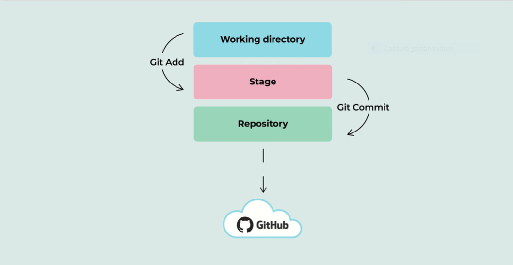
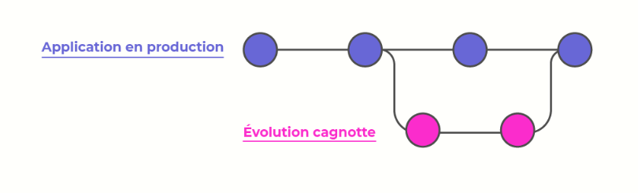
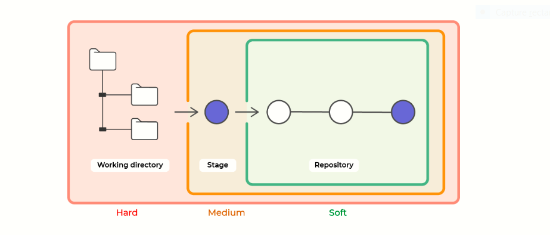

<h1 align="center">Git</h1>

---
---
## 1. La configuration globale de git 👍
---

* ## Configurer votre nom et votre email :  
---  
`git config --global user.name "ERRAMI Fadel Ellah"`  
`git config --global user.email fadelellaherrami@gmail.com`
*  ## configuer les couleurs :  
---
`git config --global color.diff auto`  
`git config --global color.status auto ` 
		
		La commande git config --global color.diff auto est utilisée pour
 	activer la coloration syntaxique des différences de code dans Git.
 	Elle permet d'afficher des différences de couleur pour les modifications,
 	ajouts et suppressions de fichiers dans les commandes Git telles que git diff.
	Les commandes git config --global color.status auto et git config --global color.
	diff auto activent tous deux la coloration syntaxique dans Git, mais pour des éléments différents.

	La commande git config --global color.status auto active la coloration syntaxique pour les états de 
	fichiers dans Git, tels que les fichiers modifiés, ajoutés ou supprimés dans la commande git status. 
	Cela permet d'afficher des couleurs pour chaque état de fichier, ce qui rend l'affichage des états de 
	fichiers plus facile à comprendre et à visualiser.

	La commande git config --global color.diff auto, quant à elle, active la coloration syntaxique pour 
	les différences de code dans Git, telles que les modifications, ajouts et suppressions de fichiers 
	dans la commande git diff. Cela permet d'afficher des différences de couleur pour les modifications 
	apportées au code, ce qui rend la visualisation et la compréhension des modifications plus facile.

`git config --global color.branch auto`  

`git config --global core.editor vim`  
`git config --global merge.tool vimdiff`   

	vim est un éditeur de texte en ligne de commande populaire, qui est installé par défaut sur
 	de nombreuses distributions Linux et est également disponible sur d'autres systèmes d'exploitation.
	vimdiff est une fonctionnalité de Vim qui permet de comparer deux fichiers côte à côte dans une vue
 	à deux panneaux. Cela peut être utile pour visualiser les différences entre deux versions d'un même 
	fichier, ou pour comparer deux fichiers différents.
	Lorsque vous exécutez la commande vimdiff file1 file2, Vim ouvre deux fenêtres côte à côte,
 	affichant les deux fichiers en question. Les différences sont surlignées dans chaque fichier, permettant
 	de visualiser rapidement les différences entre les deux fichiers. Vous pouvez également naviguer entre les
 	différences à l'aide de commandes spécifiques de Vim.

`git init` 

		Cette commande va initialiser votre dépot , en créant un dossier caché .git dans votre dossier courant 
	ce dossier contient la configuration de votre projet git , ces objets et son pointeur .

	
	Pour vérifier que vos paramètres ont bien été pris en compte, et vérifier les autres paramètres, il suffit de passer la commande 
` git config --list`   

---  
---
## 2. Appréhendez le fonctionnement de git et github 👍
---
---    
    

	Dans Git, il existe trois états principaux pour les fichiers d'un projet : untracked (non suivi), staging (prêt pour validation), et commit (validé et enregistré dans l'historique des versions).

**Untracked** : Les fichiers qui sont présents dans le répertoire de travail (working directory) mais qui ne sont pas encore suivis par Git sont considérés comme non suivis (untracked). Cela signifie que Git ne suit pas les modifications apportées à ces fichiers et ne les inclura pas dans le prochain commit. Pour suivre ces fichiers, vous devez les ajouter à l'index (staging).

**Staging** : Lorsque vous ajoutez des fichiers à l'index (staging), vous les préparez pour la validation (commit). Les fichiers en staging ont été sélectionnés pour être inclus dans le prochain commit, mais ils ne sont pas encore enregistrés dans l'historique des versions.

**Commit** : Une fois que vous avez ajouté des fichiers à l'index (staging) et que vous êtes satisfait des modifications apportées, vous pouvez les enregistrer dans l'historique des versions en effectuant un commit. Cela crée une nouvelle version de votre projet qui inclut les modifications apportées aux fichiers en staging.  

---
---
## 3. Le système de branche dans git 👍
---
---   

  

		Les branches dans Git sont un moyen de diviser le développement d'un projet en plusieurs lignes de développement distinctes. Chaque branche est une copie complète du code source du projet, et peut être modifiée de manière indépendante des autres branches.

		Les branches sont particulièrement utiles dans les projets où plusieurs développeurs travaillent sur différentes fonctionnalités en même temps, ou lorsque vous souhaitez ajouter une nouvelle fonctionnalité ou corriger un bug sans affecter le code principal du projet. Les branches permettent également d'expérimenter des idées de manière isolée, sans perturber le code de production.

		Dans Git, la branche principale est généralement appelée "master" ou "main", et chaque nouvelle branche est créée à partir de cette branche principale. Vous pouvez travailler sur une branche en toute sécurité, en faisant autant de modifications que vous le souhaitez, sans affecter le code sur d'autres branches ou sur la branche principale. Une fois que vous avez terminé vos modifications sur une branche, vous pouvez fusionner (merge) les modifications de cette branche dans la branche principale ou dans une autre branche.

	Pour connaître les branches présentes dans notre projet, il faut taper la ligne de commande :
`git branch`  

	Dans un premier temps, vous n’aurez que :  
`* main`  

	L’étoile signifie que c’est la branche sur laquelle vous vous situez, et que c’est sur celle-ci qu'actuellement vous réalisez vos modifications.  
	
	Cette commande va créer la branche Cagnotte en local. Cette dernière ne sera pas dupliquée sur le dépôt distant.
`git branch cagnotte`  

	Alors maintenant por afficher nos branches on tape : 
`git branch`  
`* main`  
`cagnotte`  

	Pour basculer de branche, nous allons utiliser :

`git checkout cagnotte`  

	Vous aurez donc :

`git branch`
`main`
`* cagnotte`

	Maintenant que vous êtes dans votre branche principale, vous pouvez fusionner votre branche "cagnotte" à celle-ci grâce à la commande suivante :

`git merge cagnotte`  
`Merge made by the 'recursive' strategy`  

---
---
---

	Imaginons que vous deviez travailler sur un projet avec des amis. Ces derniers ont créé le repository sur GitHub. Il est temps pour vous de récupérer le code pour apporter vos modifications :

	Tout d’abord, vous allez récupérer l’URL du dépôt distant : cela se passe sur GitHub !  
	Retournez sur Git Bash, et tapez la commande suivante :

`git clone https://github.com/FADELELLAHerrami/jee_training`  

	Pour donner un nom à notre dépot 
`git remote add jee https://github.com/FADELELLAHerrami/jee_training`  

		Une fois cette commande exécutée, vous pouvez utiliser le nom jee pour vous référer au référentiel distant dans les commandes Git. Par exemple, vous pouvez utiliser git push jee main pour pousser vos modifications locales vers la branche main sur le référentiel distant nommé jee.  
	
	La commande git pull origin main est utilisée pour récupérer les dernières modifications du référentiel distant nommé origin et les fusionner automatiquement avec votre branche locale main.

	Plus précisément, la commande:

		Utilise le mot-clé pull pour récupérer les modifications depuis le référentiel distant et les fusionner avec votre branche locale.
		Utilise le nom origin pour spécifier le référentiel distant à partir duquel vous souhaitez récupérer les modifications. Dans ce cas, origin est souvent utilisé comme nom par défaut pour le référentiel distant lors de la configuration initiale du projet.
		Utilise le nom main pour spécifier la branche locale sur laquelle vous souhaitez appliquer les modifications. main est souvent utilisé comme nom par défaut pour la branche principale du projet.
		En exécutant cette commande, vous récupérerez toutes les modifications qui ont été apportées à la branche main dans le référentiel distant depuis la dernière fois que vous avez synchronisé votre référentiel local avec celui-ci. Si des conflits surviennent pendant la fusion, Git vous demandera de les résoudre manuellement.   

---
---  

## 4. Collaborez sur github 👍  
---  
---  
<video src="02-16-04.mp4" autoplay></video>  

---
---

* Pour supprimer une branche :  ` git branch -d nomDeLaBranche`   
* Si vous avez déja fait des modifications dans votre branche , et vous souhaiter la supprimer : ` git branch -D nomDeLa Branche`  

La suppression de cette branche entraînera la suppression de tous les fichiers et modifications que nous n'aurez pas commités sur cette branche.

 

---  
---  
# git stash 👍
--- 

<video src="03-15-02.mp4" autoplay></video>  

---
---
# J’ai modifié la branche après avoir fait un commit
---  
---  
* Pour cette état on utilise `git log` , pour récupérer les identifiant (hash) des commit .
* Exemple 💯

		admin@VGRFJWX8PH2  ~/Desktop/learn git (main)
		$ git log
		commit 7356abb52e829480e2d6037cc25067d2b6fce8e8 (HEAD -> main, origin/main)
		Author: erramifadelellah && ayman eljamaaoui <fadelellaherrami@gmail.com>
		Date:   Sat Mar 11 02:33:14 2023 +0100

    	git training
* Pour supprimer ce commit , utilise cette commande : `git reset --hard 7356abb5`
* Exemple 💯    

			admin@VGRFJWX8PH2  ~/Desktop/Nouveau dossier (errami)
			$ git reset --hard 903f7d52
			HEAD is now at 903f7d5 second commit

* Pour supprimer le dernier commit : 

		admin@VGRFJWX8PH2  ~/Desktop/Nouveau dossier (errami)
		$ git reset --hard HEAD^
		HEAD is now at d2c1fa3 test   

* Maintenant si je voudrais modifier le message de commit 👍

-> Commit avant modification : `git commit -m "first commit  "  `
-> Commit aprés modification : `git commit --amend -m "second commit"  ` 

* Si vous faite un push sur github mais vous voulez la supprimer : vous voudrais utilisez `git revert` pour les branches publique , et `git reset` pour les branches privées .  
---  
---  
# git reset 👍
---   

		La commande    git reset  est un outil complexe et polyvalent pour annuler les changements. Elle peut être appelée de trois façons différentes, qui correspondent aux arguments de ligne de commande --soft, --mixed et --hard.  

  

		La commande git reset --hard peut en effet supprimer toutes les modifications non enregistrées (non committées) que vous avez apportées à votre projet depuis le dernier commit. Cette commande réinitialise votre projet à l'état du dernier commit enregistré, en supprimant toutes les modifications non enregistrées. Elle supprime également tous les fichiers ajoutés dans l'index (staging area) via git add, ce qui signifie qu'ils ne seront pas inclus dans le prochain commit.

		La commande git reset --mixed supprime la référence au dernier commit enregistré et réinitialise l'index (staging area) au dernier commit, mais elle ne modifie pas les fichiers dans le répertoire de travail, ce qui signifie que vous conservez vos modifications locales non enregistrées. Vous pouvez alors revoir les modifications et les ajouter à l'index de nouveau avec git add pour effectuer un nouveau commit.

		Enfin, la commande git reset --soft réinitialise simplement la référence au dernier commit enregistré sans modifier les fichiers de votre répertoire de travail ni l'index (staging area). Cela vous permet d'apporter des modifications supplémentaires et de créer un nouveau commit contenant ces modifications.

		Il convient de noter que git reset modifie l'historique des commits de votre branche et peut entraîner la perte de données non enregistrées ou non sauvegardées. Il est donc important de comprendre l'effet de chaque option avant de les utiliser et de sauvegarder votre travail en cas de doute.  

			La commande git reset --soft et git reset --mixed ont toutes deux pour effet de déplacer la branche HEAD vers un commit spécifique et de modifier l'état de l'index (staging area) en conséquence. Cependant, leur effet sur le répertoire de travail est différent.

			git reset --soft déplace simplement la branche HEAD vers le commit spécifié, sans modifier l'index ni le répertoire de travail. Cela signifie que les modifications apportées depuis le dernier commit restent dans l'index et dans le répertoire de travail. Cette commande est souvent utilisée pour "défaire" un ou plusieurs commits précédents sans perdre les modifications apportées depuis le dernier commit.

			git reset --mixed déplace également la branche HEAD vers le commit spécifié, mais modifie également l'index en conséquence. Les modifications apportées depuis le dernier commit sont supprimées de l'index, mais restent dans le répertoire de travail. Cette commande est souvent utilisée pour "défaire" un ou plusieurs commits précédents et revenir à l'état précédent, tout en conservant les modifications apportées dans le répertoire de travail.

			En résumé, la principale différence entre git reset --soft et git reset --mixed est que la première conserve les modifications non indexées (non enregistrées) tandis que la seconde supprime ces modifications de l'index mais les conserve dans le répertoire de travail.  

---  
---  
# git log  👍
--- 

`git log` Par défaut,    git log    énumère en ordre chronologique inversé les commits réalisés. Cela signifie que les commits les plus récents apparaissent en premier. Cette commande affiche chaque commit avec son identifiant SHA, l'auteur du commit, la date et le message du commit.   

`git reflog`  va loguer les commits ainsi que toutes les autres actions que vous avez pu faire en local : vos modifications de messages, vos merges, vos resets, enfin tout, quoi  . Comme    git log   ,   git reflog  affiche un identifiant SHA-1 pour chaque action. Il est donc très facile de revenir à une action donnée grâce au SHA. Cette commande, c'est votre joker, elle assure votre survie en cas d'erreur. Pour revenir à une action donnée, on prend les 8 premiers caractères de son SHA et on fait : `git checkout e789e7c`  

`git blame (NomDeFichier)` La commande    git blame   permet d’examiner le contenu d’un fichier ligne par ligne et de déterminer la date à laquelle chaque ligne a été modifiée, et le nom de l’auteur des modifications  .  

`git blame`  va afficher pour chaque ligne modifiée :

-> son ID ;

-> l'auteur ;

-> l'horodatage ;

-> le numéro de la ligne ;

-> le contenu de la ligne.  

Admettons que vous travailliez sur une branche "Mes évolutions", et que vous ayez déjà réalisé plusieurs commits. Votre collègue a besoin de l'une de ces évolutions pour la livrer au client, mais pas des autres. C'est dans ce cas bien précis que nous allons faire appel à   `git cherry-pick`   ! Cette commande va permettre de sélectionner un ou plusieurs commits grâce à leur SHA (décidément ils sont partout) et de les migrer sur la branche principale, sans pour autant fusionner toute la branche "Mes évolutions".

